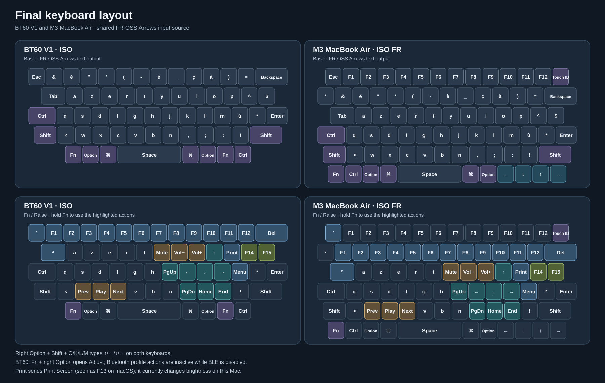

# BT60 V1 ZMK configuration

This repository builds firmware for the BT60 V1 soldered board with an ISO layout. It uses ZMK `v0.3` and the custom keymap in `config/bt60_v1.keymap`.

The current keymap keeps plain Escape and the existing Raise/Adjust positions,
with F14 and F15 replacing Scroll Lock and Insert on the two keys right of P.
The Caps position sends Control, the bottom-left key opens Raise, and Fn + Tab
sends the FR-OSS ² position. Fn + Escape sends a backtick with the matching
macOS input source. The existing Alt/Command positions stay as they are; this
BT60 already has a macOS per-device Alt/Command swap. See
[`macos/README.md`](macos/README.md) for the matching M3 MacBook Air layout
and Fn rules.



Use the [local interactive keyboard check](tools/keycheck/README.md) to verify
the MacBook and BT60 one key at a time before relying on the new layout.

## Building

The firmware can be built locally with a ZMK development container. This
machine's ignored `.zmk-build/` directory contains the pinned ZMK v0.3
workspace and its build cache. Reuse it for subsequent builds:

```sh
cp -R config/. .zmk-build/config/
docker run --rm -u "$(id -u):$(id -g)" -e HOME=/tmp \
  -v "$(pwd -P)/.zmk-build:/work" -w /work \
  zmkfirmware/zmk-build-arm:stable \
  west build -s zmk/app -d build -b bt60_v1 -- \
  -DZephyr_DIR=/work/zephyr/share/zephyr-package/cmake \
  -DZMK_CONFIG=/work/config
```

The output is `.zmk-build/build/zephyr/zmk.uf2`. Copy it to a convenient
location before flashing. A fresh local workspace needs ZMK's container setup
and `west update`; see the [ZMK local build instructions](https://zmk.dev/docs/development/local-toolchain/setup/container).
The GitHub Actions workflow remains available if you choose to push later.

The build target is set in `build.yaml`. The ZMK release is pinned to `v0.3` in both `config/west.yml` and `.github/workflows/build.yml`; keep those two versions in sync when upgrading.

## Bluetooth

Bluetooth is intentionally disabled in `config/bt60_v1.conf` with `CONFIG_ZMK_BLE=n`. The Bluetooth profile bindings remain in the keymap for later use, but have no effect while Bluetooth is disabled.

To restore Bluetooth, change that line to `CONFIG_ZMK_BLE=y`, then build and flash the new firmware. The USB connection remains available in either configuration.

## Flashing on macOS

Connect the keyboard with a USB data cable. Double press the reset button on the underside, or hold Fn and the right Option-position key, then tap `R`. Before flashing this new keymap, the old firmware uses Caps-position + right Option-position + `R` instead. A `BT60` drive should appear in Finder. Copy the UF2 file to that drive. It will disappear when flashing finishes and the keyboard restarts.
